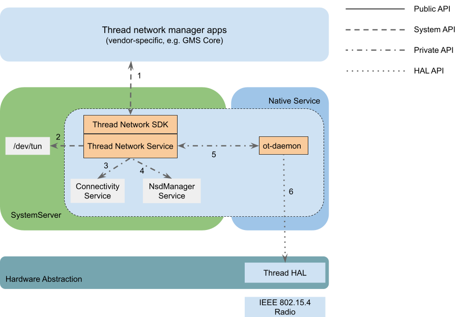
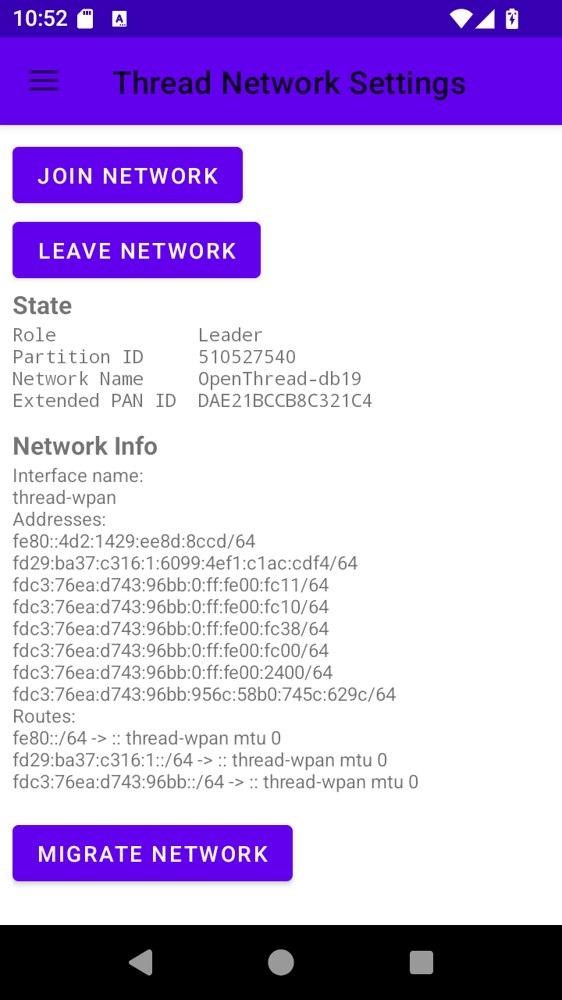

# Build an Android Border Router

If you are not an Android device or Thread chip vendor, you can stop reading
now.

This document walks you through the steps to build a new Android-based Thread
Border Router device with the latest AOSP source code. By following this
document, you will learn:

1. [the overall architecture and status of Thread support in Android](#architecture)
2. [how to create your own Thread HAL service](#build-your-thread-hal-service)
3. [how to make your device compatible with Google Home](#be-compatible-with-google-home)
4. [how to test your Thread Border Router](#testing)

If you need support, file an issue in
[GitHub](https://github.com/openthread/ot-br-posix/issues) or open a
[Dicussion](https://github.com/orgs/openthread/discussions) if you have any
questions.

Note: Before creating an issue or discussion, search to see if it has already
been reported or asked.

## Overview

The Android Thread stack is based on OpenThread and `ot-br-posix` which are
open-sourced by Google in GitHub. The same way OpenThread is developed in a
public GitHub repository, so the Android Thread stack is developed in the
public [AOSP codebase](https://cs.android.com/). All features and bug fixes
are submitted first in AOSP. This allows vendors to start adopting the latest
Thread versions without waiting for regular Android releases.

### Architecture

The whole Android Thread stack consists of two major components: the core
Thread stack in a generic system partition and the Thread HAL service in a
vendor partition. Device vendors typically need only to take care and build the
HAL service.



Here is a brief summary of how the Android Thread stack works:
- There is a Java Thread system service in the system server which manages the
  whole stack - provides the Thread system API, creates the `thread-wpan`
  tunnel interface, registers the Thread network to the
  [Connectivity service](https://developer.android.com/reference/android/content/Context#CONNECTIVITY_SERVICE)
  and implements the Border Routing and Advertising Proxy functionalities.
- The core Thread / OpenThread stack is hosted in a non-privileged standalone
  native process which is named `ot-daemon`. `ot-daemon` is directly managed
  by the Java system service via private AIDL APIs and it accesses the Thread
  hardware radio through the Thread HAL API.
- A vendor-provided Thread HAL service MUST implement the Thread HAL API. It
  typically works as an
  [RCP](https://openthread.io/platforms/co-processor#radio_co-processor_rcp)
  and implements the
  [spinel](https://openthread.io/platforms/co-processor#spinel_protocol)
  protocol.

Note: Both the Java system service and ot-daemon are delivered in a
[Tethering](https://source.android.com/docs/core/ota/modular-system/tethering#overview)
mainline module. For mobile devices, the binary is managed by Google and
delivered to devices via Google Play monthly. For non-mobile devices such as
TV, vendors are free to build from source or use a prebuilt.

### Where is the code?

- The Android Thread framework / API and service: https://cs.android.com/android/platform/superproject/main/+/main:packages/modules/Connectivity/thread/
- The Thread HAL API and default service implementation: https://cs.android.com/android/platform/superproject/main/+/main:hardware/interfaces/threadnetwork/
- Imported OpenThread repo: https://cs.android.com/android/platform/superproject/main/+/main:external/openthread/
- Imported ot-br-posix repo: https://cs.android.com/android/platform/superproject/main/+/main:external/ot-br-posix/

## Set up development environment

Android device vendors who have already established an Android development
environment for the device can skip this section.

If you are new to Android ecosystem or you are a silicon vendor who wants to
make your Thread chip compatible with Android and provide support for device
vendors, keep reading.

### Follow the Android developer codelab

To set up your Android development environment for the first time, use the
following codelab: https://source.android.com/docs/setup/start. At the end of
this codelab, you will be able to build and run a simulated Cuttlefish device
from source code.

## Build your Thread HAL service

### Try Thread in Cuttlefish

[Cuttlefish](https://source.android.com/docs/devices/Cuttlefish) is the virtual
Android device. Before starting building your own HAL service, it's better to
try Thread in Cuttlefish to understand how HAL works.

A default Thread HAL service is provided in Cuttlefish and it's implemented
with the [simulated RCP](https://github.com/openthread/openthread/tree/main/examples/platforms/simulation)
which transceives packets via UDP socket to and from a simulated
Thread (802.15.4) radio.

In the Cuttlefish instance, a "ThreadNetworkDemoApp" is pre-installed. Open
that app to join the Cuttlefish device into a default Thread network.



Note: The Border Router functionalities will be started (and OMR address will
be created) only when the Cuttlefish device is connected to a virtual Wi-Fi
network. You can connect the Wi-Fi network in Settings.

There are also the `ot-ctl` and `ot-cli-ftd` command line tools provided to
configure your Thread network for testing. Those tools support all the
OpenThread CLI commands that you may be familiar with already.

You can grep for logs of the Cuttlefish Thread HAL service by:

```
$ adb logcat | egrep -i threadnetwork-service

07-21 10:43:05.048     0     0 I init    : Parsing file /apex/com.android.hardware.threadnetwork/etc/threadnetwork-service.rc...
07-21 10:59:27.233   580   580 W android.hardware.threadnetwork-service: ThreadChip binder is unlinked
07-21 10:59:27.233   580   580 I android.hardware.threadnetwork-service: Close IThreadChip successfully
07-21 10:59:27.385   580   580 I android.hardware.threadnetwork-service: Open IThreadChip successfully
```

Or grep for ot-daemon logs by:

```
$ adb logcat | egrep -i ot-daemon
07-21 10:43:48.741     0     0 I init    : starting service 'ot-daemon'...
07-21 10:43:48.742     0     0 I init    : Created socket '/dev/socket/ot-daemon/thread-wpan.sock', mode 660, user 1084, group 1084
07-21 10:43:48.762     0     0 I init    : ... started service 'ot-daemon' has pid 2473
07-21 10:46:26.320  2473  2473 I ot-daemon: [I] P-Daemon------: Session socket is ready
07-21 10:46:30.290  2473  2473 W ot-daemon: [W] P-Daemon------: Daemon read: Connection reset by peer
07-21 10:48:07.264  2473  2473 I ot-daemon: [INFO]-BINDER--: Start joining...
07-21 10:48:07.267  2473  2473 I ot-daemon: [I] Settings------: Saved ActiveDataset
07-21 10:48:07.267  2473  2473 I ot-daemon: [I] DatasetManager: Active dataset set
07-21 10:48:07.273  2473  2473 I ot-daemon: [I] DnssdServer---: Started
07-21 10:48:07.273  2473  2473 I ot-daemon: [N] Mle-----------: Role disabled -> detached
07-21 10:48:07.273  2473  2473 I ot-daemon: [I] Mle-----------: AttachState Idle -> Start
07-21 10:48:07.273  2473  2473 I ot-daemon: [I] Notifier------: StateChanged (0x111fd11d) [Ip6+ Role LLAddr MLAddr KeySeqCntr Ip6Mult+ Channel PanId NetName ExtPanId ...
07-21 10:48:07.273  2473  2473 I ot-daemon: [I] Notifier------: StateChanged (0x111fd11d) ... NetworkKey PSKc SecPolicy NetifState ActDset]
```

Note: You can also capture Thread system server log with the tag
"ThreadNetworkService".

The Cuttlefish Thread HAL service uses the default Thread HAL service plus the
OpenThread simulated RCP binary, see the next section for how it works.

### The default HAL service

A [default HAL service](https://cs.android.com/android/platform/superproject/main/+/main:hardware/interfaces/threadnetwork/aidl/default/)
is included along with the Thread HAL API. The default HAL service supports
both simulated and real RCP devices. It receives an optional RCP device URL and
if the URL is not provided, it defaults to the simulated RCP device.

In file `hardware/interfaces/threadnetwork/aidl/default/threadnetwork-service.rc`:

```
service vendor.threadnetwork_hal /apex/com.android.hardware.threadnetwork/bin/hw/android.hardware.threadnetwork-service
    class hal
    user thread_network
```

This is equivalent to:

```
service vendor.threadnetwork_hal /apex/com.android.hardware.threadnetwork/bin/hw/android.hardware.threadnetwork-service spinel+hdlc+forkpty:///apex/com.android.hardware.threadnetwork/bin/ot-rcp?forkpty-arg=1
    class hal
    user thread_network
```

For real RCP devices, it supports both SPI and UART interfaces and you can
specify the device with the schema `spinel+spi://`, `spinel+hdlc+uart://` and
`spinel+socket://` respectively.

Note: `spinel+socket://` is a new spinel interface added in the default Thread
HAL, it supports transmitting spinel frame via an Unix socket. A full
socket-based radio URL may be like
`spinel+socket:///data/vendor/threadnetwork/thread_spinel_socket`.

#### Understand the vendor APEX

Similar to the Thread stack in the Tethering mainline module, the default Thread
HAL service in Cuttlefish is packaged in an APEX module as well. But it's a
vendor APEX module which will be installed to `/vendor/apex/` (The artifacts in
the module will be unzipped to `/apex/com.android.hardware.threadnetwork/`).

```aidl
apex {
    name: "com.android.hardware.threadnetwork",
    manifest: "manifest.json",
    file_contexts: "file_contexts",
    key: "com.android.hardware.key",
    certificate: ":com.android.hardware.certificate",
    updatable: false,
    vendor: true,

    binaries: [
        "android.hardware.threadnetwork-service",
        "ot-rcp",
    ],

    prebuilts: [
        "threadnetwork-default.xml", // vintf_fragment
        "threadnetwork-service.rc", // init_rc
        "android.hardware.thread_network.prebuilt.xml", // permission
    ],
}
```

There are a few important configurations that you will need to pay attention or
make changes to when building your own HAL APEX module:

- `file_contexts`: This describes the binary / data files delivered in this
  APEX module or files the HAL service need to access (for example, the RCP
  device). This allows you to specify specific sepolicy rules for your HAL
  service to access the hardware RCP device.
- `binaries`: The binary file delivered in this APEX module
- `threadnetwork-service.rc`: How the HAL service will be started. You need to
  specify the RCP device path here.
- `android.hardware.thread_network.prebuilt.xml`: Defines the
  `android.hardware.thread_network` hardware feature. This is required for the
  Android system to know that your device does have Thread hardware support.
  Otherwise, the Android Thread stack won't be enabled.

### Create your HAL service

Whether you are an Android device developer or a silicon vendor, you should be
familiar with building OT RCP firmware for your Thread chip. The following
instructions assume that the hardware chip is correctly wired and
validated.

The simplest way to build your HAL APEX is to create a new APEX with the
binaries and prebuilts of the default HAL APEX. For example, if your company is
Banana and the RCP device on your device is `/dev/ttyACM0`, your Thread HAL
APEX will look like this:

- `Android.bp`:
  ```
  prebuilt_etc {
    name: "banana-threadnetwork-service.rc",
    src: "banana-threadnetwork-service.rc",
    installable: false,
  }

  apex {
    name: "com.banana.android.hardware.threadnetwork",
    manifest: "manifest.json",
    file_contexts: "file_contexts",
    key: "com.android.hardware.key",
    certificate: ":com.android.hardware.certificate",
    updatable: false,
    vendor: true,

    binaries: [
        "android.hardware.threadnetwork-service",
    ],

    prebuilts: [
        "banana-threadnetwork-service.rc",
        "threadnetwork-default.xml",
        "android.hardware.thread_network.prebuilt.xml",
    ],
  }
  ```
- `file_contexts`:
  ```
  (/.*)?                                                      u:object_r:vendor_file:s0
  /etc(/.*)?                                                  u:object_r:vendor_configs_file:s0
  /bin/hw/android\.hardware\.threadnetwork-service            u:object_r:hal_threadnetwork_default_exec:s0
  /dev/ttyACM0                                                u:object_r:threadnetwork_rcp_device:s0
  ```
  The file paths in the first column are related to `/apex/com.android.hardware.threadnetwork/`.
- `threadnetwork-service.rc`:
  ```
  service vendor.threadnetwork_hal /apex/com.android.hardware.threadnetwork/bin/hw/android.hardware.threadnetwork-service spinel+hdlc+uart:///dev/ttyACM0?uart-baudrate=115200
    class hal
    user root
  ```
- `manifest.json`:
  ```
  {
    "name": "com.android.hardware.threadnetwork",
    "version": 1
  }
  ```

Note: The default Thread HAL service is not designed to be a generic system
component which works for all Android devices. If the default implementation
can't support your device, you are free to make a copy and change it for your
needs. In this case, it's just simpler to create a new APEX module without
overriding the default one.

Assuming you are making a new device named Orange, your device specific
configuration directory will be like:

```
device/banana/orange/threadnetwork/
    sepolicy/
    Android.bp
    file_contexts
    manifest.json
    threadnetwork-default.xml
    threadnetwork-service.rc
```

See the next section for what sepolicy rules should be added in the `sepolicy/`
sub-directory.

#### Sepolicy rules for RCP device

By default, your Thread HAL service doesn't have access to the RCP device (for
example `/dev/ttyACM0`), custom sepolicy rules need to be added to the
`sepolicy/` directory.

Create a new `sepolicy/threadnetwork_hal.te` file with below content:

```
type threadnetwork_rcp_device, dev_type;

# Allows the Thread HAL service to read / write the Thread RCP device
allow hal_threadnetwork_default threadnetwork_rcp_device:chr_file rw_file_perms;
```

#### Put together

Now you have finished almost all the code needs for adding Thread, the last
step is to add the Thread HAL APEX and sepolicy rules to your device's image.

You can do this by adding below code to your device's `Makefile` (for example,
`device.mk`):

```
PRODUCT_PACKAGES += com.banana.hardware.threadnetwork
BOARD_SEPOLICY_DIRS += device/banana/orange/threadnetwork/sepolicy
```

Note: Unfortunately, APEX module doesn't support sepolicy rules, so you need
to explicitly specify the sepolicy directory separately.

If everything works, now you will be able to see the Thread HAL service log similar to:

```
$ adb logcat | egrep -i threadnetwork-service
08-13 13:26:41.751   477   477 I android.hardware.threadnetwork-service: ServiceName: android.hardware.threadnetwork.IThreadChip/chip0, Url: spinel+spi
08-13 13:26:41.751   477   477 I android.hardware.threadnetwork-service: Thread Network HAL is running
08-13 13:26:55.165   477   477 I android.hardware.threadnetwork-service: Open IThreadChip successfully
```

And the `ot-daemon` log will be like:

```
$ adb logcat -s ot-daemon
08-13 13:26:55.157  1019  1019 I ot-daemon: [NOTE]-AGENT---: Running OTBR_AGENT/Unknown
08-13 13:26:55.157  1019  1019 I ot-daemon: [NOTE]-AGENT---: Thread version: 1.3.0
08-13 13:26:55.157  1019  1019 I ot-daemon: [NOTE]-AGENT---: Thread interface: thread-wpan
08-13 13:26:55.157  1019  1019 I ot-daemon: [NOTE]-AGENT---: Backbone interface is not specified
08-13 13:26:55.157  1019  1019 I ot-daemon: [NOTE]-AGENT---: Radio URL: threadnetwork_hal://binder?none
08-13 13:26:55.157  1019  1019 I ot-daemon: [NOTE]-ILS-----: Infra link selected:
08-13 13:26:55.160  1019  1019 I ot-daemon: [I] Platform------: [HAL] Wait for getting the service android.hardware.threadnetwork.IThreadChip/chip0 ...
08-13 13:26:55.165  1019  1019 I ot-daemon: [I] Platform------: [HAL] Successfully got the service android.hardware.threadnetwork.IThreadChip/chip0
08-13 13:26:55.275  1019  1019 I ot-daemon: [I] P-RadioSpinel-: RCP reset: RESET_UNKNOWN
08-13 13:26:55.276  1019  1019 I ot-daemon: [I] P-RadioSpinel-: Software reset RCP successfully
08-13 13:26:55.277  1019  1019 I ot-daemon: [I] P-RadioSpinel-: RCP reset: RESET_POWER_ON
08-13 13:26:55.322  1019  1019 I ot-daemon: [I] ChildSupervsn-: Timeout: 0 -> 190
08-13 13:26:55.324  1019  1019 I ot-daemon: [I] RoutingManager: Initializing - InfraIfIndex:0
08-13 13:26:55.324  1019  1019 I ot-daemon: [I] InfraIf-------: Init infra netif 0
08-13 13:26:55.324  1019  1019 I ot-daemon: [I] Settings------: Read BrUlaPrefix fd7b:cc45:ff06::/48
08-13 13:26:55.324  1019  1019 I ot-daemon: [N] RoutingManager: BR ULA prefix: fd7b:cc45:ff06::/48 (loaded)
08-13 13:26:55.324  1019  1019 I ot-daemon: [I] RoutingManager: Generated local OMR prefix: fd7b:cc45:ff06:1::/64
08-13 13:26:55.324  1019  1019 I ot-daemon: [N] RoutingManager: Local on-link prefix: fdde:ad00:beef:cafe::/64
08-13 13:26:55.324  1019  1019 I ot-daemon: [I] RoutingManager: Enabling
```

## Customization

The Thread mainline module (it's actually a part of the "Tethering" module)
provides a few [overlayable configurations](https://source.android.com/docs/core/runtime/rros)
which can be specified by vendors to customize the stack behavior. See
[config_thread.xml](https://cs.android.com/android/platform/superproject/main/+/main:packages/modules/Connectivity/service/ServiceConnectivityResources/res/values/config_thread.xml)
for the full list.

Typically, you must change the `config_thread_vendor_name`,
`config_thread_vendor_oui` and `config_thread_model_name` to your vendor or
product values. Those values will be included in the `_meshcop._udp` mDNS
service which is always advertised by a Thread Border Router.

To add the overlay, you need to create a new `ConnectivityOverlayOrange`
runtime_resource_overlay target for your Orange device. Create a new
`ConnectivityOverlay/` directory under `device/banana/orange/rro_overlays` and
create below contents in it:

```
device/banana/orange/rro_overlays/ConnectivityOverlay/
  res
    values
      config_thread.xml
  Android.bp
  AndroidManifest.xml
```

- `Android.bp`:
  ```
  package {
      default_applicable_licenses: ["Android-Apache-2.0"],
  }

  runtime_resource_overlay {
      name: "ConnectivityOverlayOrange",
      manifest: "AndroidManifest.xml",
      resource_dirs: ["res"],
      certificate: "platform",
      product_specific: true,
      sdk_version: "current",
  }
  ```
- `AndroidManifest.xml`:
  ```
  <!-- Orange overlays for the Connectivity module -->
  <manifest xmlns:android="http://schemas.android.com/apk/res/android"
      package="com.banana.android.connectivity.resources.orange"
      android:versionCode="1"
      android:versionName="1.0">
      <application android:hasCode="false" />

      <!-- If your device uses google-signed mainline modules, the targetPackage
      needs to be "com.google.android.connectivity.resources", otherise, it
      should be "com.android.connectivity.resources"
      -->
      <overlay
          android:targetPackage="com.google.android.connectivity.resources"
          android:targetName="ServiceConnectivityResourcesConfig"
          android:isStatic="true"
          android:priority="1"/>
  </manifest>
  ```
- `config_thread.xml`:
  ```
  <string translatable="false" name="config_thread_vendor_name">Banana Inc.</string>
  <string translatable="false" name="config_thread_vendor_oui">AC:DE:48</string>
  <string translatable="false" name="config_thread_model_name">Orange</string>
  ```

Similar to the HAL APEX, you need to add the overlay app to your `device.mk`
file:

```
PRODUCT_PACKAGES += \
    ConnectivityOverlayOrange
```

If everything works, you will see that `ot-daemon` logs the vendor and model name
at the very beginning of the log:
```
$ adb logcat -s ot-daemon
07-22 15:31:37.693  1472  1472 I ot-daemon: [I] P-Daemon------: Session socket is ready
07-22 15:31:37.693  1472  1472 I ot-daemon: [I] Cli-----------: Input: state
07-22 15:31:37.693  1472  1472 I ot-daemon: [I] Cli-----------: Output: disabled
07-22 15:31:37.693  1472  1472 I ot-daemon: [I] Cli-----------: Output: Done
07-22 15:31:37.693  1472  1472 W ot-daemon: [W] P-Daemon------: Daemon read: Connection reset by peer
07-22 15:31:50.091  1472  1472 I ot-daemon: [I] P-Daemon------: Session socket is ready
07-22 15:31:50.091  1472  1472 I ot-daemon: [I] Cli-----------: Input: factoryreset
07-22 15:31:50.092  1472  1472 I ot-daemon: [I] Settings------: Wiped all info
07-22 15:31:50.092  1472  1472 I ot-daemon: [INFO]-ADPROXY-: Stopped
07-22 15:31:50.092  1472  1472 I ot-daemon: [INFO]-DPROXY--: Stopped
07-22 15:31:50.092  1472  1472 I ot-daemon: [INFO]-BA------: Stop Thread Border Agent
07-22 15:31:50.092  1472  1472 I ot-daemon: [INFO]-BA------: Unpublish meshcop service Banana Inc. Orange #4833._meshcop._udp.local
07-22 15:31:50.092  1472  1472 I ot-daemon: [INFO]-MDNS----: Removing service Banana Inc. Orange #4833._meshcop._udp
07-22 15:31:50.092  1472  1472 I ot-daemon: [INFO]-MDNS----: Unpublishing service Banana Inc. Orange #4833._meshcop._udp listener ID = 0
```

Note: In case the overlay doesn't work, check https://source.android.com/docs/core/runtime/rro-troubleshoot
for troubleshooting instructions.

### Be compatible with Google Home

Additionally, if you want to make your Border Router be used by the Google Home
ecosystem, you can specify this configuration in `config_thread.xml`:

```
<string-array name="config_thread_mdns_vendor_specific_txts">
  <item>vgh=1</item>
</string-array>
```

## Testing

Your device should be compatible with the Thread 1.3+ Border Router
specification now. Before sending it to the Thread certification program, there
are a few Android xTS tests should be exercised to ensure the compatibility.

- The VTS test makes sure Thread HAL service work as expected on your device.
  You can run the tests with command
  ```
  atest VtsHalThreadNetworkTargetTest
  ```
- The CTS test makes sure Thread APIs work as expected on your device. You can
  run the tests with command
  ```
  atest CtsThreadNetworkTestCases
  ```
- The integration test provides more quality guarantee of how the Thread
  mainline code works on your device. You can run the tests with command
  ```
  atest ThreadNetworkIntegrationTests
  ```

You can also find more instructions of how to run VTS/CTS/MTS tests with those
released test suites:

- https://source.android.com/docs/core/tests/vts
- https://source.android.com/docs/compatibility/cts/run
- https://docs.partner.android.com/mainline/test/mts (you need to be a partner to access this link)

### Test with the Thread demo app

Similar to the Cuttlefish device, you can add the Thread demo app to your system image:

```
# ThreadNetworkDemoApp for testing
PRODUCT_PACKAGES_DEBUG += ThreadNetworkDemoApp
```

Note that you should add it to only the debug / eng variant (for example,
`PRODUCT_PACKAGES_DEBUG`) given this is not supposed to be included in user
build for end consumers.
